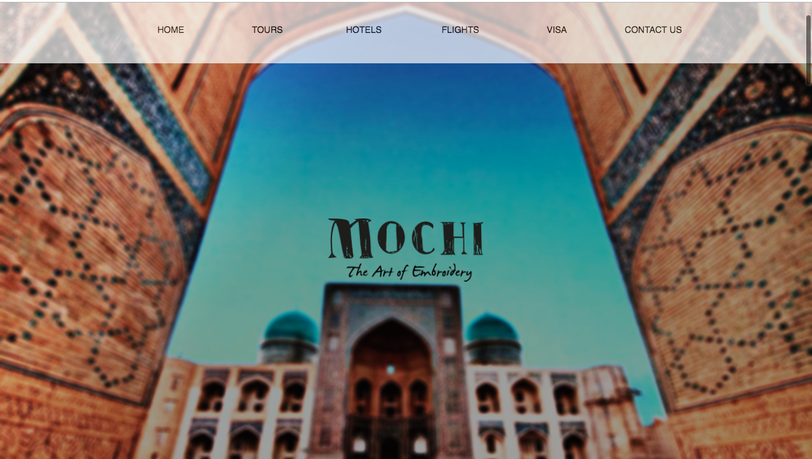
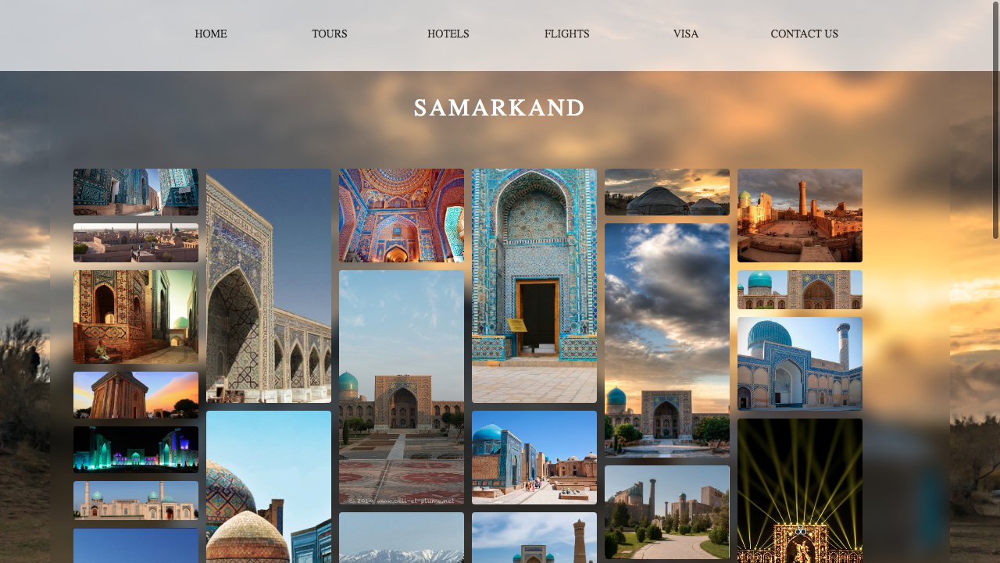

# Tousrism Website

The website is about tourism in the local area of Uzbekistan. It includes some special information on the touristic places and cities of the country.

## Used Tools
      HTML
      CSS
      JavaScript
      Windows 10
      Visual Studio
      Parallax

The Parallax was build mainly using CSS and few JavaScript techniques.

### Here, you can see the pages and parallaxing effect of the website.

